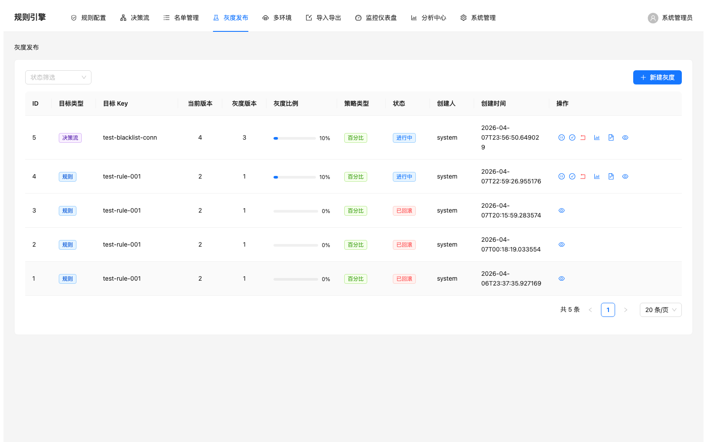
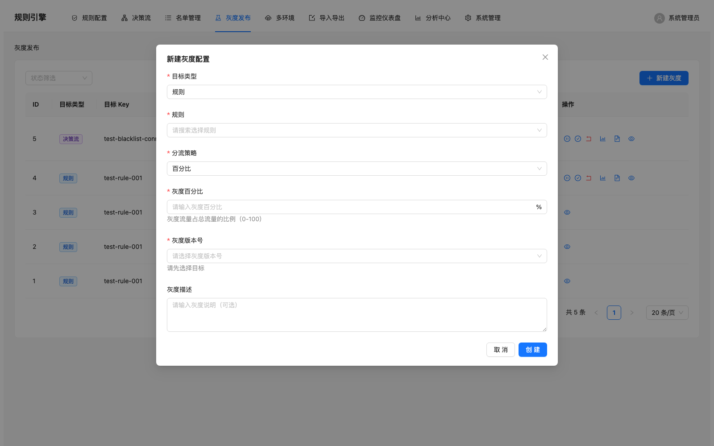
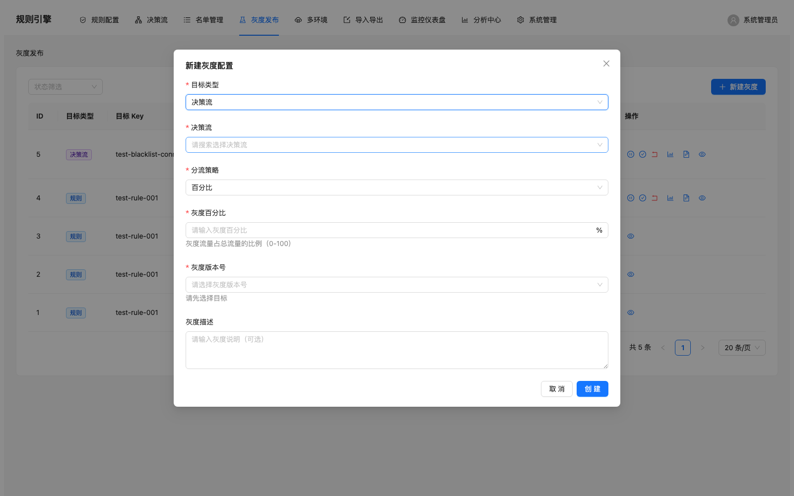
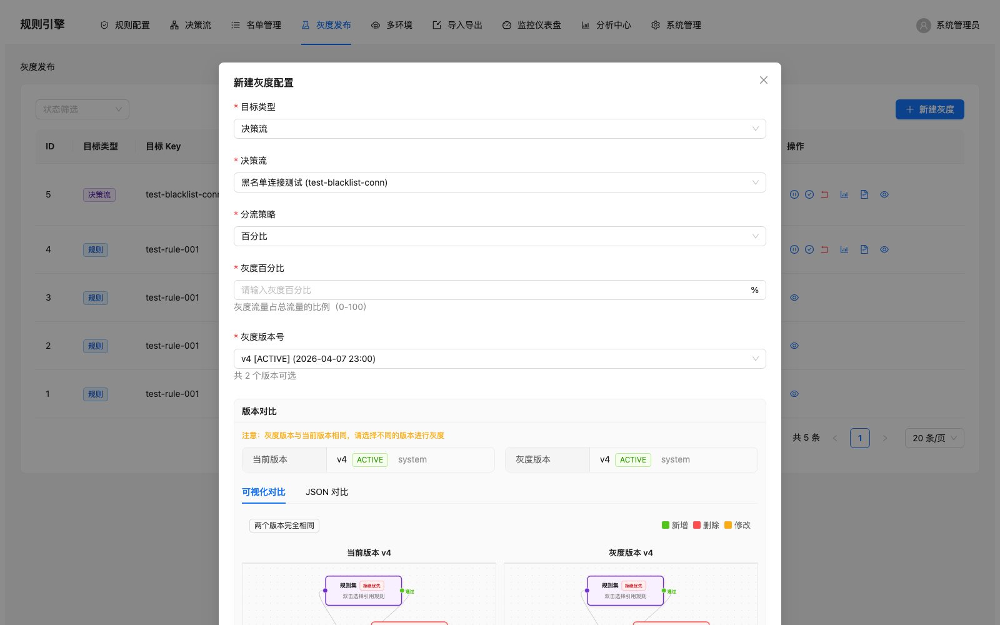
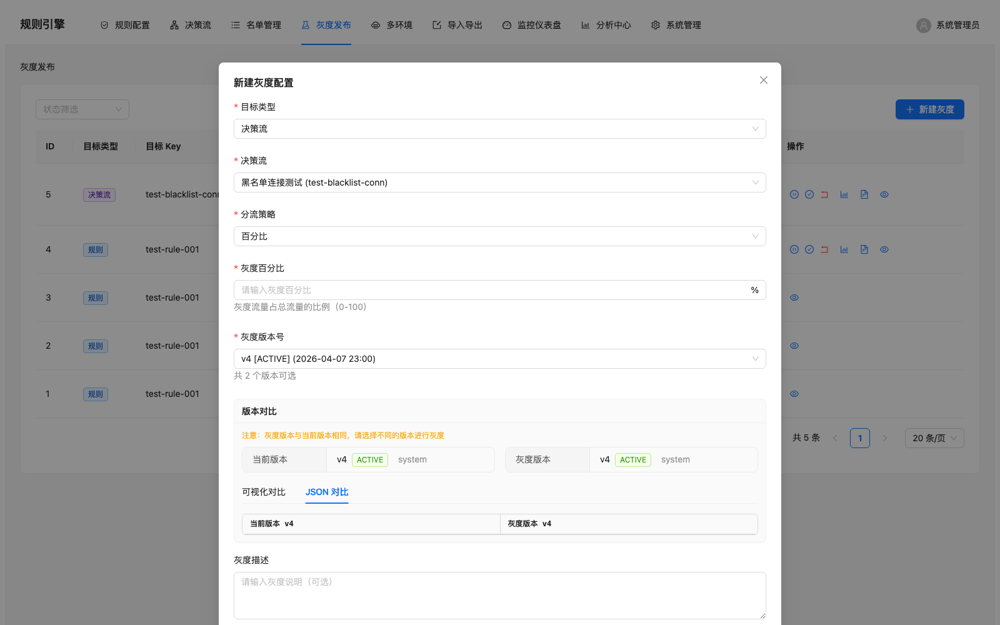

# Another Rule Engine

[English](README_EN.md) | 中文

> 面向电商反欺诈场景的低代码风控规则引擎，支持可视化规则配置、决策流编排、灰度发布和版本管理。业务人员可独立配置风控规则，**50ms 内返回决策结果**。

---

## 目录

- [功能特性](#-功能特性)
- [截图预览](#-截图预览)
- [技术架构](#-技术架构)
- [技术栈](#-技术栈)
- [快速开始](#-快速开始)
- [配置说明](#-配置说明)
- [API 概览](#-api-概览)
- [项目结构](#-项目结构)
- [功能开关](#-功能开关)
- [许可证](#-许可证)

---

## ✨ 功能特性

### 规则管理
- **可视化规则编辑器** — 表单化配置条件/动作，无需编写代码；支持切换到 Groovy DSL 模式自由编写脚本
- **决策流编排** — 基于 React Flow 的拖拽式流程编辑器，支持条件分支、规则集、黑白名单、合并等多种节点类型
- **规则测试** — 内置测试面板，输入 JSON 数据即时预览执行结果

### 版本与发布
- **版本管理** — 每次修改自动生成版本快照，支持查看完整变更历史
- **灰度发布（Canary）** — 按流量比例灰度推送新版本，支持规则和决策流的**可视化 Diff 对比**（并排 React Flow 画布 + JSON 文本对比）
- **断路器保护** — Resilience4j 断路器 + 50ms 超时熔断，保障支付链路稳定

### 权限与安全
- **RBAC 权限体系** — 基于 Sa-Token 的用户/角色/权限三级管理
- **团队数据隔离** — 多团队场景下自动隔离规则、决策流等资源
- **审计日志** — 全量记录用户操作，支持按模块/时间/操作者检索

### 监控与分析
- **监控仪表盘** — Prometheus 指标 + Grafana 可视化，覆盖 P50/P95/P99 延迟
- **执行日志** — 每次规则决策的完整执行记录，含输入、输出、耗时、命中规则
- **数据分析** — 规则命中趋势、决策分布统计

### 其他
- **名单管理** — 黑名单/白名单的增删改查，规则执行时实时引用
- **缓存管理** — Caffeine 本地缓存 + 手动刷新，规则加载 < 5ms
- **多环境管理** *(实验性)* — DEV / STAGING / PRODUCTION 环境隔离与规则克隆
- **导入导出** *(实验性)* — 规则 JSON 文件导出/导入，支持跨系统迁移

---

## 📸 截图预览

> 截图存放在 [`pub_docs/screenshots/`](pub_docs/screenshots/) 目录。

### 灰度发布 — 决策流可视化对比

| 截图 | 说明 |
|------|------|
|  | 灰度发布列表 |
|  | 新建灰度配置弹窗 |
|  | 选择决策流目标类型 |
|  | 决策流可视化版本对比 |
|  | JSON 文本版本对比 |

完整截图索引见 [`pub_docs/screenshots/README.md`](pub_docs/screenshots/README.md)。

---

## 🏗 技术架构

```
┌─────────────────────────────────────────────────┐
│                   Frontend                       │
│   React 19 + TypeScript + Ant Design + React Flow │
│                   (Port 3000)                    │
└────────────────────┬────────────────────────────┘
                     │ HTTP / REST API
                     ▼
┌─────────────────────────────────────────────────┐
│              Spring Boot 3.3 (Port 8080)         │
│  ┌──────────┐ ┌──────────┐ ┌──────────────────┐ │
│  │ Controller│ │  Service │ │  Rule Engine     │ │
│  │   Layer   │ │   Layer  │ │  (Groovy Sandbox)│ │
│  └──────────┘ └──────────┘ └──────────────────┘ │
│  ┌──────────┐ ┌──────────┐ ┌──────────────────┐ │
│  │   Auth   │ │  Cache   │ │  Resilience4j    │ │
│  │ (Sa-Token)│ │(Caffeine)│ │  (CircuitBreaker)│ │
│  └──────────┘ └──────────┘ └──────────────────┘ │
└────────────────────┬────────────────────────────┘
                     │ JPA / JDBC
                     ▼
┌─────────────────────────────────────────────────┐
│            PostgreSQL + Flyway Migration          │
└─────────────────────────────────────────────────┘
                     │
                     ▼
┌─────────────────────────────────────────────────┐
│       Prometheus + Grafana (监控可选)             │
└─────────────────────────────────────────────────┘
```

---

## 🛠 技术栈

### 后端

| 技术 | 版本 | 用途 |
|------|------|------|
| Java | 17+ | 运行时环境（推荐 Java 21 以支持虚拟线程） |
| Spring Boot | 3.3.0 | 应用框架 |
| Groovy | 4.0.22 | 规则 DSL 动态编译与执行 |
| PostgreSQL | 16+ | 数据持久化 |
| Spring Data JPA | — | ORM 框架 |
| Flyway | 11.0.0 | 数据库版本迁移 |
| Caffeine | 3.1.8 | 本地缓存 |
| Resilience4j | 2.1.0 | 断路器 / 超时熔断 |
| Sa-Token | 1.39.0 | 权限认证 |
| Micrometer | 1.12.0 | Prometheus 指标采集 |
| Gradle | 8.5+ | 构建工具 |

### 前端

| 技术 | 版本 | 用途 |
|------|------|------|
| React | 19.0 | UI 框架 |
| TypeScript | 5.6 | 类型安全 |
| Ant Design | 5.22 | 企业级 UI 组件库 |
| React Flow (@xyflow/react) | 12.10 | 决策流可视化编排 |
| Zustand | 5.0 | 状态管理 |
| Vite | 6.0 | 构建与开发服务器 |
| Axios | 1.7 | HTTP 客户端 |

### 测试

| 技术 | 用途 |
|------|------|
| JUnit 5 | 单元测试 |
| Mockito | Mock 框架 |
| H2 Database | 内存数据库（测试替身） |
| Testcontainers | 集成测试（PostgreSQL 容器） |
| JaCoCo | 代码覆盖率 |

---

## 🚀 快速开始

### 方式一：Docker Compose 一键启动（推荐）

> 前置条件：[Docker](https://docs.docker.com/get-docker/) + [Docker Compose](https://docs.docker.com/compose/install/)

```bash
# 克隆项目
git clone https://github.com/your-org/another-rule-engine.git
cd another-rule-engine

# 一键启动（PostgreSQL + 后端 + 前端）
docker compose up -d

# 查看日志
docker compose logs -f backend
```

启动完成后访问：
- **前端界面**: [http://localhost:3000](http://localhost:3000)
- **后端 API**: [http://localhost:8080](http://localhost:8080)
- **健康检查**: [http://localhost:8080/actuator/health](http://localhost:8080/actuator/health)

**自定义配置**（可选）：

```bash
# 修改数据库密码等环境变量
cp .env.example .env
# 编辑 .env 文件，然后重新启动
docker compose up -d
```

**常用命令**：

```bash
docker compose up -d          # 后台启动
docker compose down            # 停止并删除容器
docker compose down -v         # 停止并删除容器 + 数据卷（清除数据库数据）
docker compose logs -f backend # 查看后端日志
docker compose build --no-cache # 重新构建镜像
```

### 方式二：本地开发模式

#### 前置条件

| 依赖 | 最低版本 | 说明 |
|------|---------|------|
| JDK | 17 | 推荐 Java 21（支持虚拟线程） |
| PostgreSQL | 14 | 推荐 16+ |
| Node.js | 18+ | 前端开发 |
| npm | 9+ | 前端包管理 |

#### 1. 克隆项目

```bash
git clone https://github.com/your-org/another-rule-engine.git
cd another-rule-engine
```

#### 2. 配置数据库

创建 PostgreSQL 数据库：

```sql
CREATE DATABASE yare_engine;
```

编辑 `src/main/resources/application.yml`，修改数据库连接信息：

```yaml
spring:
  datasource:
    url: jdbc:postgresql://localhost:5432/yare_engine
    username: your_username
    password: your_password
```

Flyway 会在应用启动时自动执行数据库迁移脚本。

#### 3. 启动后端

```bash
# 编译项目
./gradlew build

# 启动后端服务（端口 8080）
./gradlew bootRun
```

#### 4. 启动前端

```bash
cd frontend

# 安装依赖
npm install

# 启动开发服务器（端口 3000，自动代理到后端 8080）
npm run dev
```

#### 5. 访问应用

打开浏览器访问 [http://localhost:3000](http://localhost:3000)，使用默认账号登录。

### 运行测试

```bash
# 后端测试
./gradlew test

# 后端测试 + 覆盖率报告（生成在 build/reports/jacoco/）
./gradlew test jacocoTestReport

# 前端构建检查
cd frontend && npm run build
```

---

## ⚙ 配置说明

核心配置文件：`src/main/resources/application.yml`

### 关键配置项

| 配置路径 | 默认值 | 说明 |
|---------|--------|------|
| `server.port` | `8080` | 后端服务端口 |
| `spring.datasource.*` | — | PostgreSQL 连接信息 |
| `spring.cache.caffeine.spec` | `maximumSize=5000,expireAfterWrite=10m` | 缓存策略 |
| `rule-engine.execution.default-timeout-ms` | `50` | 规则执行超时（毫秒） |
| `rule-engine.execution.degradation-decision` | `PASS` | 超时降级决策 |
| `resilience4j.circuitbreaker.instances.ruleExecution.*` | — | 断路器参数 |
| `sa-token.timeout` | `86400` | Token 有效期（秒） |

### 前端配置

前端开发代理配置在 `frontend/vite.config.ts`：

```typescript
proxy: {
  '/api': {
    target: 'http://localhost:8080',
    changeOrigin: true,
  },
}
```

---

## 📡 API 概览

所有 API 以 `/api/v1` 为前缀，以下为主要接口分组：

### 规则管理

| 方法 | 路径 | 说明 |
|------|------|------|
| GET | `/api/v1/rules` | 规则列表 |
| POST | `/api/v1/rules` | 创建规则 |
| PUT | `/api/v1/rules/{id}` | 更新规则 |
| DELETE | `/api/v1/rules/{id}` | 删除规则 |
| POST | `/api/v1/rules/{id}/test` | 测试执行规则 |

### 决策流

| 方法 | 路径 | 说明 |
|------|------|------|
| GET | `/api/v1/decision-flows` | 决策流列表 |
| POST | `/api/v1/decision-flows` | 创建决策流 |
| PUT | `/api/v1/decision-flows/{id}` | 更新决策流 |
| POST | `/api/v1/decision-flows/{id}/test` | 测试执行 |

### 版本管理

| 方法 | 路径 | 说明 |
|------|------|------|
| GET | `/api/v1/rules/{id}/versions` | 规则版本历史 |
| GET | `/api/v1/decision-flows/{id}/versions` | 决策流版本历史 |

### 灰度发布

| 方法 | 路径 | 说明 |
|------|------|------|
| GET | `/api/v1/grayscale` | 灰度配置列表 |
| POST | `/api/v1/grayscale` | 创建灰度配置 |
| PUT | `/api/v1/grayscale/{id}/status` | 更新灰度状态 |
| GET | `/api/v1/grayscale/{id}/diff` | 版本差异对比 |

### 决策执行

| 方法 | 路径 | 说明 |
|------|------|------|
| POST | `/api/v1/decision/execute` | 同步执行决策 |
| POST | `/api/v1/decision/async` | 异步执行决策 |
| GET | `/api/v1/decision/async/{id}/result` | 查询异步结果 |

### 系统管理

| 方法 | 路径 | 说明 |
|------|------|------|
| POST | `/api/v1/auth/login` | 登录 |
| POST | `/api/v1/auth/logout` | 登出 |
| GET | `/api/v1/system/users` | 用户管理 |
| GET | `/api/v1/system/roles` | 角色管理 |
| GET | `/api/v1/audit-logs` | 审计日志 |
| GET | `/api/v1/features` | 功能开关状态 |

### 监控

| 方法 | 路径 | 说明 |
|------|------|------|
| GET | `/actuator/health` | 健康检查 |
| GET | `/actuator/prometheus` | Prometheus 指标 |
| GET | `/api/v1/metrics/*` | 业务指标 |

---

## 📁 项目结构

```
another-rule-engine/
├── src/main/java/com/example/ruleengine/
│   ├── RuleEngineApplication.java      # 启动类
│   ├── controller/                     # REST API 控制器
│   │   ├── RuleController.java         # 规则 CRUD
│   │   ├── DecisionFlowController.java # 决策流管理
│   │   ├── DecisionController.java     # 决策执行
│   │   ├── GrayscaleController.java    # 灰度发布
│   │   ├── AuthController.java         # 认证授权
│   │   ├── AuditLogController.java     # 审计日志
│   │   ├── NameListController.java     # 名单管理
│   │   ├── AnalyticsController.java    # 数据分析
│   │   ├── MetricsController.java      # 监控指标
│   │   └── ...                         # 其他控制器
│   ├── service/                        # 业务逻辑层
│   │   ├── RuleExecutionService.java   # 规则执行服务
│   │   ├── DecisionFlowExecutionService.java
│   │   ├── grayscale/                  # 灰度发布
│   │   ├── version/                    # 版本管理
│   │   ├── auth/                       # 认证授权
│   │   ├── audit/                      # 审计日志
│   │   ├── analytics/                  # 数据分析
│   │   └── ...
│   ├── engine/                         # 规则引擎核心
│   │   ├── GroovyScriptEngine.java     # Groovy 脚本执行引擎
│   │   ├── ScriptCacheManager.java     # 脚本编译缓存
│   │   ├── ClassLoaderManager.java     # 类加载器管理
│   │   ├── SecurityConfiguration.java  # 沙箱安全配置
│   │   └── SecurityAuditService.java   # 安全审计
│   ├── domain/                         # JPA 实体
│   │   ├── Rule.java                   # 规则
│   │   ├── RuleVersion.java            # 规则版本
│   │   ├── DecisionFlow.java           # 决策流
│   │   ├── GrayscaleConfig.java        # 灰度配置
│   │   ├── ExecutionLog.java           # 执行日志
│   │   ├── SysUser.java / SysRole.java / SysPermission.java
│   │   └── ...
│   ├── model/                          # DTO / Request / Response
│   ├── repository/                     # JPA Repository
│   ├── config/                         # Spring 配置类
│   ├── exception/                      # 全局异常处理
│   ├── cache/                          # 缓存配置
│   ├── constants/                      # 常量定义
│   └── metrics/                        # 指标采集
│
├── src/main/resources/
│   ├── application.yml                 # 应用配置
│   └── db/migration/                   # Flyway 迁移脚本 (V1 ~ V22+)
│
├── frontend/                           # React 前端
│   ├── src/
│   │   ├── pages/                      # 页面组件
│   │   │   ├── RuleListPage.tsx        # 规则列表
│   │   │   ├── RuleEditPage.tsx        # 规则编辑
│   │   │   ├── DecisionFlowEditorPage.tsx  # 决策流编辑器
│   │   │   ├── GrayscalePage.tsx       # 灰度发布
│   │   │   ├── MonitoringPage.tsx      # 监控面板
│   │   │   ├── AnalyticsPage.tsx       # 数据分析
│   │   │   ├── NameListPage.tsx        # 名单管理
│   │   │   ├── system/                 # 系统管理
│   │   │   │   ├── UserManagementPage.tsx
│   │   │   │   ├── RoleManagementPage.tsx
│   │   │   │   └── AuditLogPage.tsx
│   │   │   └── ...
│   │   ├── components/                 # 通用组件
│   │   │   ├── flow/                   # 决策流编辑器组件
│   │   │   │   ├── FlowCanvas.tsx      # React Flow 画布
│   │   │   │   ├── NodePalette.tsx     # 节点面板
│   │   │   │   ├── NodeConfigPanel.tsx # 节点配置
│   │   │   │   ├── nodes/             # 自定义节点类型
│   │   │   │   │   ├── ConditionNode.tsx   # 条件节点
│   │   │   │   │   ├── RuleSetNode.tsx     # 规则集节点
│   │   │   │   │   ├── BlacklistNode.tsx   # 黑名单节点
│   │   │   │   │   ├── WhitelistNode.tsx   # 白名单节点
│   │   │   │   │   ├── MergeNode.tsx       # 合并节点
│   │   │   │   │   └── ...
│   │   │   ├── rules/                  # 规则编辑器组件
│   │   │   ├── FlowGraphDiff.tsx       # 决策流可视化 Diff
│   │   │   ├── DiffViewer.tsx          # 通用文本 Diff
│   │   │   └── ...
│   │   ├── api/                        # API 调用层
│   │   ├── stores/                     # Zustand 状态管理
│   │   ├── hooks/                      # 自定义 Hooks
│   │   ├── layouts/                    # 布局组件
│   │   ├── types/                      # TypeScript 类型定义
│   │   └── utils/                      # 工具函数
│   ├── vite.config.ts                  # Vite 配置
│   └── package.json                    # 前端依赖
│
├── pub_docs/                           # 公开文档
│   ├── screenshots/                    # 截图
│   ├── multi-environment.md            # 多环境功能文档
│   └── import-export.md                # 导入导出功能文档
│
├── Dockerfile                          # 后端 Docker 镜像（多阶段构建）
├── docker-compose.yml                  # 一键部署（PostgreSQL + 后端 + 前端）
├── .dockerignore                       # Docker 构建排除
├── build.gradle                        # Gradle 构建配置
├── settings.gradle                     # Gradle 设置
└── CLAUDE.md                           # AI 辅助开发上下文
```

---

## 🚦 功能开关

部分功能默认关闭（开发中），可通过 `application.yml` 手动启用：

```yaml
rule-engine:
  features:
    multi-environment:
      enabled: false    # 设为 true 启用多环境管理（DEV/STAGING/PROD）
    import-export:
      enabled: false    # 设为 true 启用规则导入导出
```

启用后，前端侧边栏会自动显示对应菜单项。详见：

- [多环境管理文档](pub_docs/multi-environment.md)
- [导入导出文档](pub_docs/import-export.md)

---

## 📄 许可证

本项目仅供学习和研究使用。未经授权不得用于商业用途。
