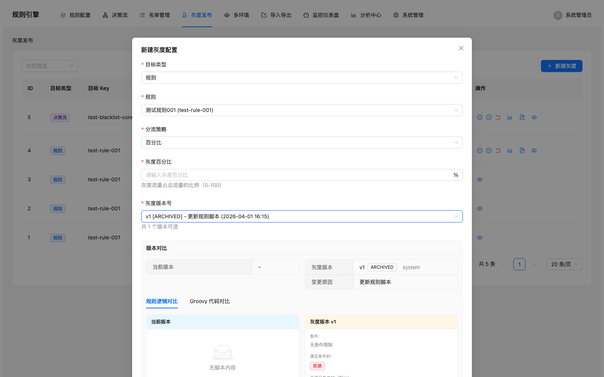
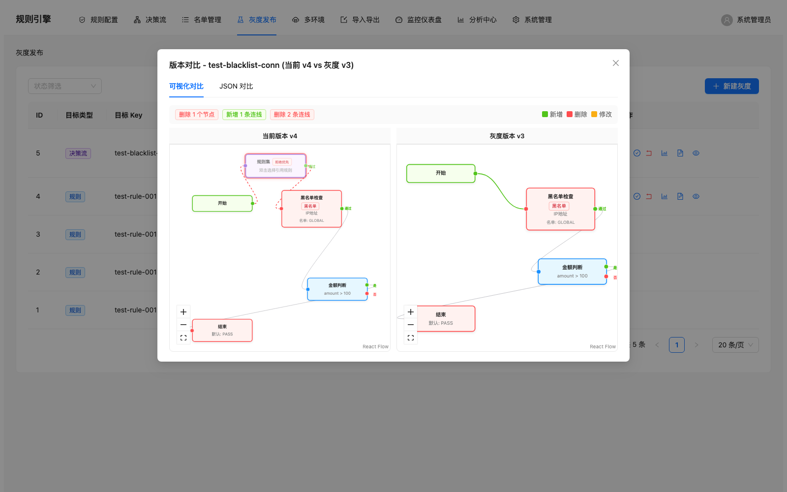

[中文](README.md) | English

<p align="center">
  
</p>

<h1 align="center">Another Rule Engine</h1>

<p align="center">
  <strong>A low-code fraud prevention rule engine with visual editing, version control, and canary deployment.</strong>
</p>

<p align="center">
  
  
  
  
  
  
</p>

---

## Table of Contents

- [Screenshots](#-screenshots)
- [Features](#-features)
- [Architecture Overview](#-architecture-overview)
- [Tech Stack](#-tech-stack)
- [Getting Started](#-getting-started)
- [Configuration](#-configuration)
- [API Overview](#-api-overview)
- [Project Structure](#-project-structure)
- [Feature Flags](#-feature-flags)
- [License](#-license)

---

## Screenshots

Screenshots are available in the [`pub_docs/screenshots/`](pub_docs/screenshots/) directory.

| Feature | Preview |
|---------|---------|
| Grayscale List |  |
| Create Grayscale (Rule) |  |
| Decision Flow Visual Diff |  |
| Version Comparison (Visual) |  |

> See [`pub_docs/screenshots/README.md`](pub_docs/screenshots/README.md) for the full gallery.

---

## Features

### Rule Engine Core
- **Visual Rule Editor** -- Form-based rule creation with condition groups, logic operators, and live Groovy DSL preview
- **Decision Flow Editor** -- Drag-and-drop flow builder powered by React Flow with Start, Condition, Action, RuleSet, Merge, Blacklist, Whitelist, and End nodes
- **Groovy Sandbox Execution** -- Rules execute in a secured Groovy sandbox with AST-level and runtime-level safety checks
- **< 50ms SLA** -- Circuit breaker (Resilience4j), compiled script cache (Caffeine), and timeout enforcement ensure sub-50ms decisions

### Version & Release
- **Full Version History** -- Every rule and decision flow change is recorded with version number, diff, operator, and change reason
- **Grayscale / Canary Release** -- Configure traffic percentage, header-based, or user-ID-based canary strategies with side-by-side visual diff between versions
- **One-Click Rollback** -- Revert to any previous version instantly

### Access Control
- **RBAC with Sa-Token** -- Role-based permissions on both API endpoints and frontend menu items
- **Team-Based Data Isolation** -- Multi-tenant support via team-scoped data filtering
- **Audit Logging** -- Every create, update, delete, and execution action is logged with operator and timestamp

### Operations
- **Name List Management** -- Blacklist / whitelist management with scoped keys for fraud prevention
- **Monitoring Dashboard** -- Prometheus metrics + built-in analytics page for execution statistics
- **Multi-Environment Support** -- DEV / STAGING / PRODUCTION environments with rule cloning (feature-flagged)
- **Import / Export** -- JSON-based rule backup and cross-system migration (feature-flagged)

---

## Architecture Overview

```
┌──────────────────────────────────────────────────────────┐
│                     React 19 Frontend                     │
│  Ant Design + React Flow + Zustand + TypeScript           │
│  Port 3000  ─────── proxy /api ──────►  Port 8080         │
└──────────────────────────┬───────────────────────────────┘
                           │ HTTP / REST
┌──────────────────────────▼───────────────────────────────┐
│                  Spring Boot 3.3 Backend                   │
│                                                           │
│  ┌─────────────┐  ┌──────────────┐  ┌──────────────────┐ │
│  │ Controllers  │  │   Services   │  │  Rule Engine     │ │
│  │ (REST API)   │  │ (Business    │  │  (Groovy Script  │ │
│  │ Sa-Token     │  │  Logic +     │  │   Sandbox +      │ │
│  │ RBAC Filter) │  │  Lifecycle)  │  │   Cache)         │ │
│  └──────┬───────┘  └──────┬───────┘  └────────┬─────────┘ │
│         │                 │                    │           │
│  ┌──────▼─────────────────▼────────────────────▼─────────┐ │
│  │              JPA / Hibernate + Flyway                  │ │
│  └──────────────────────┬────────────────────────────────┘ │
└─────────────────────────┼──────────────────────────────────┘
                          │ JDBC
                 ┌────────▼────────┐
                 │   PostgreSQL    │
                 │  (Port 5432)    │
                 └─────────────────┘

      Optional Monitoring Stack:
      Prometheus ◄── Actuator /metrics ──► Grafana
```

---

## Tech Stack

### Backend

| Technology | Version | Purpose |
|------------|---------|---------|
| Java | 17+ (21 recommended) | Runtime with virtual thread support |
| Spring Boot | 3.3.0 | Application framework |
| Groovy | 4.0.22 | Dynamic rule DSL and script execution |
| PostgreSQL | 16+ | Primary database |
| Spring Data JPA | 3.2.x | ORM and data access |
| Flyway | 11.0.0 | Database migration |
| Caffeine | 3.1.8 | In-memory script cache |
| Resilience4j | 2.1.0 | Circuit breaker and time limiter |
| Sa-Token | 1.39.0 | Authentication and RBAC |
| spring-security-crypto | 6.3.0 | BCrypt password hashing |
| Micrometer + Prometheus | 1.12.0 | Metrics collection |

### Frontend

| Technology | Version | Purpose |
|------------|---------|---------|
| React | 19.0 | UI framework |
| TypeScript | 5.6 | Type safety |
| Ant Design | 5.22 | Enterprise UI components |
| @xyflow/react | 12.10 | Decision flow visual editor |
| Zustand | 5.0 | Lightweight state management |
| Axios | 1.7 | HTTP client |
| react-router-dom | 7.0 | Client-side routing |
| Vite | 6.0 | Build tool and dev server |

### Testing

| Technology | Version | Purpose |
|------------|---------|---------|
| JUnit 5 | 5.10.1 | Unit testing |
| Mockito | 5.8.0 | Mocking framework |
| H2 | 2.2.224 | In-memory database for tests |
| Testcontainers | 1.19.3 | Integration testing with Docker |
| JaCoCo | 0.8.11 | Code coverage |

---

## Getting Started

### Prerequisites

- **Java 17+** (Java 21 recommended for virtual threads)
- **PostgreSQL 16+** running on `localhost:5432`
- **Node.js 18+** and npm
- **Gradle 8.5+** (wrapper included)

### 1. Clone the Repository

```bash
git clone https://github.com/your-org/another-rule-engine.git
cd another-rule-engine
```

### 2. Set Up the Database

Create a PostgreSQL database:

```sql
CREATE DATABASE yare_engine;
```

Update connection settings in `src/main/resources/application.yml` if needed. Flyway will automatically run all migrations on startup.

### 3. Start the Backend

```bash
./gradlew bootRun
```

The backend starts at `http://localhost:8080`.

### 4. Start the Frontend

```bash
cd frontend
npm install
npx vite --port 3000
```

The frontend is available at `http://localhost:3000`. API requests to `/api/*` are automatically proxied to the backend.

### 5. Verify

Open `http://localhost:3000` in your browser and log in with the default credentials.

### Running Tests

```bash
# Run all backend tests
./gradlew test

# Run a single test class
./gradlew test --tests RuleEngineTest

# Run with coverage report (HTML at build/reports/jacoco/)
./gradlew test jacocoTestReport
```

---

## Configuration

All runtime configuration lives in [`src/main/resources/application.yml`](src/main/resources/application.yml).

| Setting | Default | Description |
|---------|---------|-------------|
| `server.port` | `8080` | Backend HTTP port |
| `spring.datasource.url` | `jdbc:postgresql://192.168.5.202:5432/yare_engine` | Database connection URL |
| `spring.jpa.hibernate.ddl-auto` | `validate` | Schema validation only (Flyway manages migrations) |
| `spring.cache.type` | `caffeine` | Script cache backend |
| `rule-engine.execution.default-timeout-ms` | `50` | Rule execution timeout (ms) |
| `rule-engine.execution.degradation-decision` | `PASS` | Fallback decision on timeout |
| `resilience4j.circuitbreaker.instances.ruleExecution.failure-rate-threshold` | `50` | Circuit breaker failure threshold (%) |
| `sa-token.timeout` | `86400` | Session timeout in seconds |

Frontend proxy is configured in [`frontend/vite.config.ts`](frontend/vite.config.ts) -- all `/api` requests forward to `http://localhost:8080`.

---

## API Overview

All endpoints are prefixed with `/api/v1/`. Authentication requires an `Authorization` header (Sa-Token).

| Group | Endpoints | Description |
|-------|-----------|-------------|
| **Authentication** | `POST /auth/login`, `POST /auth/logout` | Login and session management |
| **Rules** | `GET/POST /rules`, `GET/PUT/DELETE /rules/{id}` | Full CRUD for rules |
| **Rule Versions** | `GET /rules/{id}/versions`, `POST /rules/{id}/versions`, `POST /rules/{id}/rollback` | Version history and rollback |
| **Decision Flows** | `GET/POST /decision-flows`, `GET/PUT/DELETE /decision-flows/{id}` | Decision flow management |
| **Flow Versions** | `GET /decision-flows/{id}/versions`, `POST /decision-flows/{id}/rollback` | Flow version history |
| **Decisions** | `POST /decide` (sync), `POST /decide/async` (async) | Execute rules and return decisions |
| **Grayscale** | `GET/POST /grayscale`, `PUT/DELETE /grayscale/{id}` | Canary release configuration |
| **Name Lists** | `GET/POST /name-lists`, `GET/PUT/DELETE /name-lists/{id}` | Blacklist / whitelist management |
| **Environments** | `GET /environments`, `GET /environments/{id}/rules`, `POST /environments/{from}/clone/{to}` | Multi-environment management |
| **Import/Export** | `GET /export/rules`, `POST /import/rules` | Rule backup and migration |
| **Monitoring** | `GET /metrics/*`, `GET /execution-logs/*`, `GET /analytics/*` | Metrics, logs, and analytics |
| **System** | `GET/POST /system/users`, `GET/POST /system/roles`, `GET /audit-logs` | User, role, and audit management |
| **Actuator** | `GET /actuator/health`, `GET /actuator/prometheus` | Spring Boot monitoring endpoints |

---

## Project Structure

```
another-rule-engine/
├── build.gradle                          # Gradle build configuration
├── settings.gradle                       # Project settings
├── CLAUDE.md                             # AI-assisted development context
├── pub_docs/                             # Product documentation & screenshots
│   ├── screenshots/                      # UI screenshots
│   ├── multi-environment.md              # Multi-env feature doc
│   └── import-export.md                  # Import/export feature doc
│
├── src/main/java/com/example/ruleengine/
│   ├── RuleEngineApplication.java        # Application entry point
│   ├── config/                           # Spring configuration
│   │   ├── CacheConfiguration.java
│   │   ├── FeatureProperties.java        # Feature flag bindings
│   │   ├── Resilience4jConfig.java
│   │   ├── SaTokenConfig.java
│   │   └── StpInterfaceImpl.java         # Permission lookup
│   ├── controller/                       # REST API controllers (21 files)
│   ├── domain/                           # JPA entities (19 files)
│   ├── engine/                           # Rule execution engine
│   │   ├── GroovyScriptEngine.java       # Core script executor
│   │   ├── ScriptCacheManager.java       # Caffeine-based script cache
│   │   ├── ClassLoaderManager.java       # ClassLoader lifecycle
│   │   ├── SecurityConfiguration.java    # Groovy sandbox config
│   │   └── SecurityAuditService.java     # Runtime script auditing
│   ├── model/                            # DTOs and request/response models
│   ├── repository/                       # JPA repositories (18 files)
│   ├── service/                          # Business logic layer
│   │   ├── auth/                         # Authentication & team management
│   │   ├── grayscale/                    # Canary release logic
│   │   ├── lifecycle/                    # Rule & flow lifecycle
│   │   ├── version/                      # Version management
│   │   └── ...                           # Analytics, async, import/export
│   └── ...
│
├── src/main/resources/
│   ├── application.yml                   # Main configuration
│   └── db/migration/                     # Flyway SQL migrations (V1-V22)
│
└── frontend/
    ├── package.json
    ├── vite.config.ts                    # Vite + API proxy config
    └── src/
        ├── api/                          # API client modules (12 files)
        ├── components/
        │   ├── flow/                     # Decision flow editor components
        │   │   ├── FlowCanvas.tsx
        │   │   ├── NodePalette.tsx
        │   │   ├── NodeConfigPanel.tsx
        │   │   └── nodes/               # Custom flow node types (8 nodes)
        │   ├── rules/                    # Rule editor components
        │   │   ├── CreateRuleModal.tsx
        │   │   ├── RuleTable.tsx
        │   │   ├── RuleTestModal.tsx
        │   │   └── form/                # Condition & logic group editors
        │   ├── AuthGuard.tsx             # Route protection
        │   ├── PermissionGuard.tsx       # Permission-based rendering
        │   ├── DiffViewer.tsx            # Text diff component
        │   └── FlowGraphDiff.tsx         # Visual flow diff component
        ├── layouts/                      # App shell with menu & RBAC
        ├── pages/                        # Route pages (15 files)
        ├── stores/                       # Zustand stores (auth, rules, flows)
        ├── hooks/                        # Custom React hooks
        ├── types/                        # TypeScript type definitions
        └── utils/                        # Utility functions
```

---

## Feature Flags

Features that are still in development can be toggled via `application.yml`:

```yaml
rule-engine:
  features:
    multi-environment:
      enabled: false    # Set true to enable DEV/STAGING/PROD environments
    import-export:
      enabled: false    # Set true to enable JSON rule import/export
```

**How it works:**

| Layer | Mechanism |
|-------|-----------|
| Backend | `@ConditionalOnProperty` on controllers and services -- beans are not loaded when disabled |
| Frontend | `GET /api/v1/features` returns flag states; menu items are hidden dynamically |
| API | `/api/v1/features` endpoint reflects current configuration |

See [`pub_docs/multi-environment.md`](pub_docs/multi-environment.md) and [`pub_docs/import-export.md`](pub_docs/import-export.md) for details on each feature.

---

## License

All rights reserved. This project is not open-source licensed yet.
